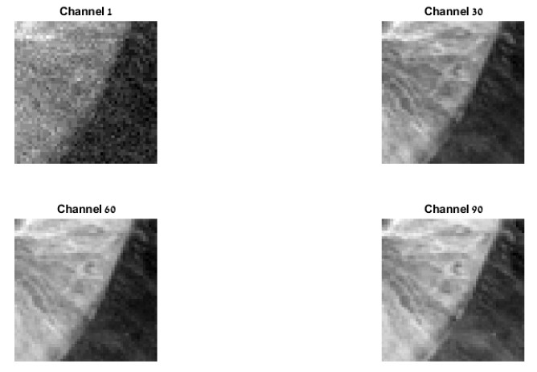
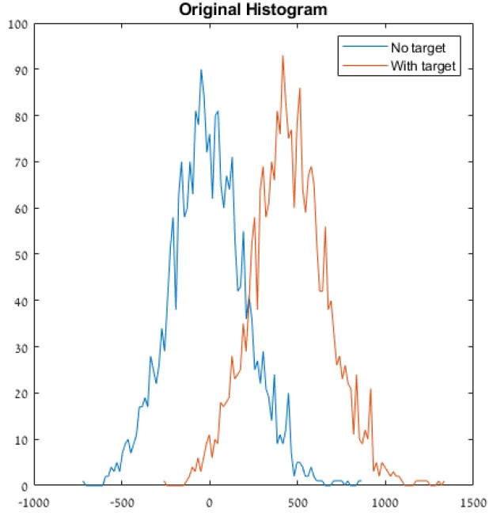
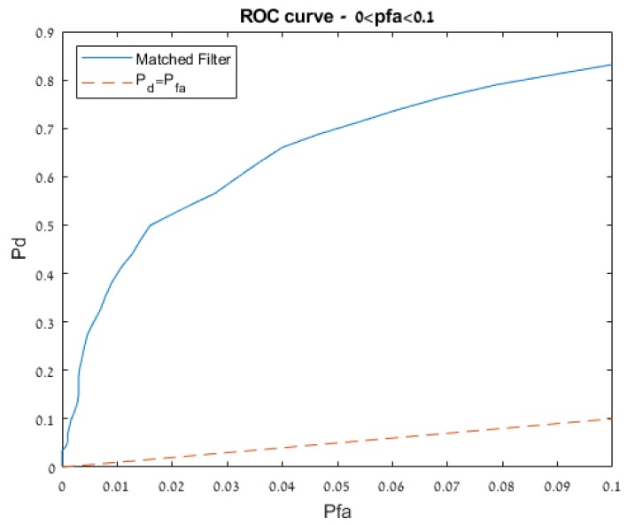

# Debbi's Cube
This repo contains a step-by-step guide of Hyperspectal Target Detection in MATLAB.
The guide goes through loading the data and visualsing it:

Implementing the Matched-Filter target detection algorithm:

Analyzing the results:

And finally, generating an ROC curve:

## License
[MIT Open Source](https://choosealicense.com/licenses/mit/)

Feel free to use this work as long as you refrence this repo.

Contact: doronser@post.bgu.ac.il
